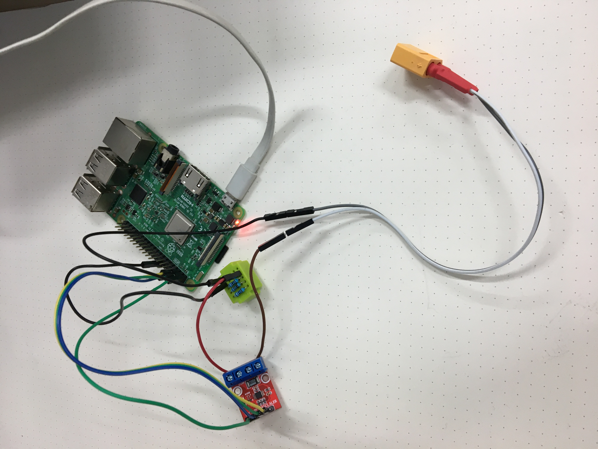
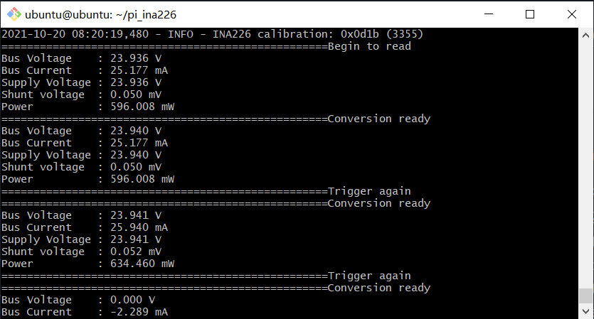

# pi_ina226
## Introduction
This Python library supports the [INA226](https://www.ti.com/lit/ds/symlink/ina226.pdf) voltage, current and power monitor from Texas Instruments with a Raspberry Pi using the I2C bus. The intent of the library is to make it easy to use the quite complex functionality of this sensor.

The library currently not only supports continuous reads of voltage and power, but also triggered reads.

The library supports the detection of overflow in the current/power calculations which results in meaningless values for these readings.

The low power mode of the INA226 is supported, so if only occasional reads are being made in a battery based system, current consumption can be minimised.

## Lists the steps for configuring, measuring, and calculating the values for current and power for this device.

| STEP   |      REGISTER NAME     | ADDRESS | CONTENTS | DEC     | LSB         | VALUE       |
|--------|:----------------------:|---------|----------|:-------:|------------:|------------:|
| Step 1 | Configuration Register | 00      | 41FF     | ----    | ----        | ----        |
| Step 2 |  Calibration Register  | 05      | 0D1B     | 3355    | ----        | ----        |
| Step 3 |  Bus Voltage Register  | 02      | 4AD2     | 19154   | 1.25 mV     | 23.942 V    |
| Step 4 |    Current Register    | 04      | FFDA     | -38     | 7.624e-4 A  | -28.992 mA  |
| Step 5 |     Shunt Register     | 01      | FFE9     | -23     | 2.5 µV      | -0.058 mV   |
| Step 6 |     Power Register     | 03      | 0024     | 36      | 19.2 mW     | 692.139 mW  |

## Usage

keep waiting to continue

## Test 
### Preparing 
The library has been tested with the Raspi 4b+.

### Result

